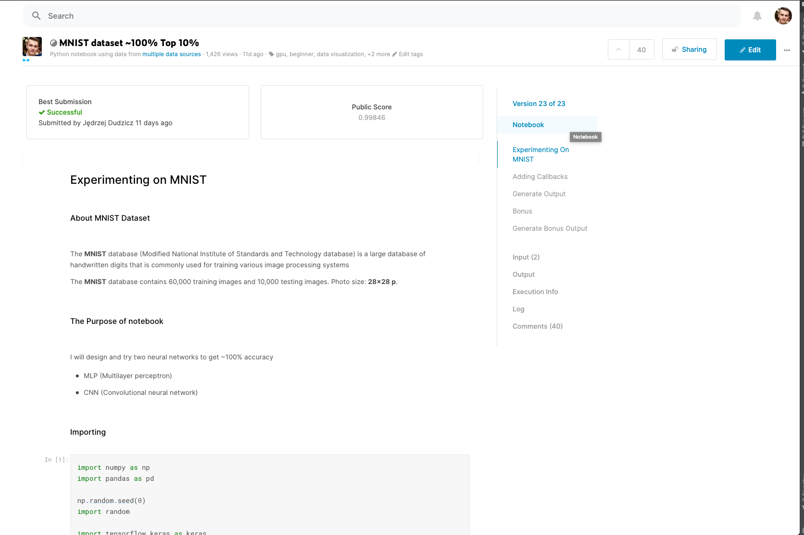
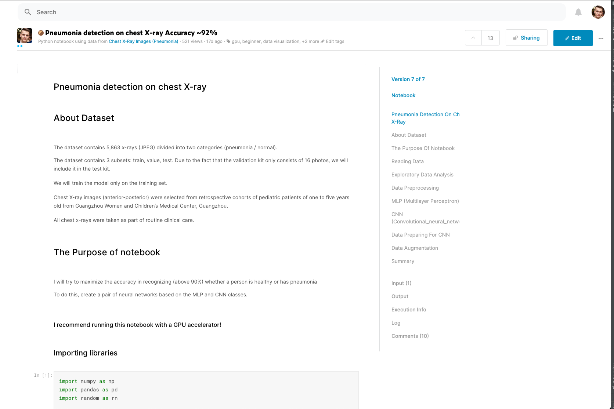

# Kaggle Notebooks

- [General Info](#General-Info)

- [Notebooks](#Notebooks)

- [Technologies](#Technologies)

--- 

## General Info

These are my kaggle notebooks that I made in my spare time.

---

## Notebooks

- [MNIST dataset](https://www.kaggle.com/jedrzejdudzicz/mnist-dataset-100)
    ### Description
        In this notebook, I was working on the MNIST dataset. 
        The goal was to identify handwritten numbers close to 100 percent.
    
    ### Screenshot
    
    
    ### Versions
    * **[Update 18.08.2020]**\
    Creation of the CNN network
    * **[Update 21.08.2020]**\
    Adding a visualization [Top 34%]
    * **[Update 01.09.2020]**\
    Adding data augmentation, batch normalization and callbacks [Top 10%]
    * **[Update 15.09.2020]**\
    Adding extra dataset to improve accuracy to 99.8 [Top 6%]
    
    * **[Update 03.05.2021]**\
    Adding Occlusion sensitivity and changing metrics to f1 [Top 4%]
    
    
    ### Summary
    The final accuracy of 99.6% was achieved on the MNIST data set prepared for the [competition](https://www.kaggle.com/c/digit-recognizer)
***

- [Diagnosis of pneumonia chest X-ray](https://www.kaggle.com/jedrzejdudzicz/pneumonia-detection-on-chest-x-ray-accuracy-90)

    ### Description
        I will be working with the Chest X-ray dataset (5863 JPEG) to create a universal model for pneumonia diagnosis. 
        The goal is to know with over 90% accuracy whether a person is healthy, has bacterial or viral pneumonia.

    ### Screenshot
    
    
    ### Versions
    * **[Update 02.09.2020]**\
    Creation first version with CNN network
    
    * **[Update 08.09.2020]**\
    Create a description
    ### Summary
    The final accuracy of ~92% was achieved.

***
- [Housing pirces prediction](https://www.kaggle.com/jedrzejdudzicz/housing-prices-prediction-top-2)

    ### Description
        The dataset contains processed housing price data. 
        My goal was to maximize the accuracy of price prediction for an advertisement.

    ### Screenshot
    
    
    ### Versions
    * **[Update 14.05.2021]**\
    First version with EDA and modeling.
   
    ### Summary
    The final submission is Top 2% on leaderboard.

--- 

## Technologies

- Python (Numpy, Pandas)
- Jupyter Notebook
- TensorFlow

